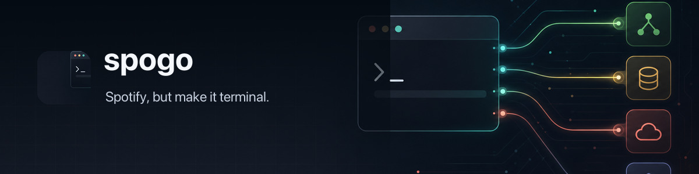

# 🎧 spogo - Spotify, but make it terminal.



 Power CLI using Spotify browser cookies or official OAuth. Search, control playback, manage library/playlists, and script with JSON/plain output.

Product direction and compatibility policy: [VISION.md](VISION.md).

## Features

- Search tracks, albums, artists, playlists, shows, episodes
- Playback control: play/pause/next/prev/seek/volume/shuffle/repeat
- Play artists (starts with top tracks)
- Queue management
- Library management (save/remove/follow)
- User listening data: top tracks by Spotify affinity and available recent plays
- Playlist management (create/add/remove/list)
- Device selection and status
- Browser cookie import via `sweetcookie`
- Official Spotify Authorization Code OAuth with PKCE, refresh tokens, and a secure per-profile token cache
- Explicit `--auth cookies|oauth` selection for Web API requests
- `--json` and `--plain` for scripting
- Colorized human output (respects `NO_COLOR`, `TERM=dumb`, `--no-color`)
- Engine switch: `auto` (connect → web → local Spotify.app for playback on macOS), `connect` (internal endpoints), `web` (Web API endpoints; search/info/playback fall back to connect on rate limit)

## Cookies and OAuth

Cookie auth remains the default because Spotify's official Web API has strict rate limits that can make it impractical for agents and automation. Browser cookies let spogo use the same internal endpoints as the Spotify web player for catalog search, item lookup, library listing, listening history, and most playback and playlist operations:

- **Fewer public-API rate limits** - Most reads and playback use the same internal endpoints as open.spotify.com
- **No app registration** - No need to create a Spotify Developer app
- **Full functionality** - Access to everything the web player can do
- **Agent-friendly** - Perfect for AI assistants and automation scripts

Import your cookies once with `sweetcookie` and you're good to go (defaults to Chrome).

Some operations still require Spotify's public Web API: saving/removing library tracks or albums, following/unfollowing artists, creating playlists, artist-top-track lookups used by artist playback, and certain device transfers or playback fallbacks. Explicit `--engine web` also uses the public API. These paths can return `429`; when Spotify supplies a cooldown, spogo reports its `retry-after hint`, which can be several hours.

For a cookie-free Web API setup, spogo also supports Spotify's official Authorization Code flow with PKCE:

```bash
spogo auth oauth login --client-id YOUR_SPOTIFY_CLIENT_ID
spogo --engine web --auth oauth search track "weezer"
```

OAuth never uses a client secret. Connect and internal endpoints still require browser cookies; selecting OAuth changes the Web API token provider, not the Connect protocol.

## Install

### Homebrew

```bash
brew install steipete/tap/spogo
```

### Build from Source

```bash
go install github.com/steipete/spogo/cmd/spogo@latest
```

## Quick start

```bash
spogo auth import --browser chrome
spogo auth import --browser chrome --browser-profile "Profile 1"
spogo search track "weezer" --limit 5
spogo play spotify:track:7hQJA50XrCWABAu5v6QZ4i
spogo status
```

## Usage

```bash
spogo [global flags] <command> [args]
```

Global flags:

- `--config <path>` config file path
- `--profile <name>` profile name
- `--timeout <dur>` request timeout (default 10s)
- `--market <cc>` market country code
- `--language <tag>` language/locale (default `en`)
- `--device <name|id>` target device
- `--engine <auto|web|connect|applescript>` API engine (default `connect`, `applescript` is macOS-only)
- `--auth <cookies|oauth>` Web API authentication (default `cookies`)
- `--spotify-client-id <id>` public Spotify application client ID
- `--spotify-redirect-uri <uri>` registered loopback OAuth redirect URI
- `--json` / `--plain`
- `--no-color`
- `-q, --quiet` / `-v, --verbose` / `-d, --debug`

Env overrides:

- `SPOGO_TOTP_SECRET_URL` override TOTP secret source (http(s) or `file://...`)
- `SPOGO_CONNECT_VERSION` override connect client version sent to playback endpoints

Commands:

- `completion bash|zsh|fish`
- `auth status|import|paste|clear`
- `auth oauth login|status|clear`
- `search track|album|artist|playlist|show|episode`
- `track info`, `album info`, `artist info`, `playlist info`, `show info`, `episode info`
- `play [<id|url>] [--type ...] [--shuffle]`, `pause`, `next`, `prev`, `seek`, `volume`, `shuffle`, `repeat`, `status`
- `queue add|show`
- `library tracks|albums|artists|playlists`
- `user top-tracks|history`
- `playlist create|add|remove|tracks`
- `device list|set`

Full spec: `docs/spec.md`.

## Authentication

Cookie auth is the default. Import cookies once:

```bash
spogo auth import --browser chrome
```

Defaults: Chrome + Default profile. Cookies are stored under your config directory (per profile).
If import still fails, `spogo` now surfaces browser-store warnings instead of only printing `no cookies found`.

### Manual cookie paste (WSL fallback)

If WSL cookie import/decryption is broken, paste cookies from Chrome DevTools:

1) Developer Tools -> Application tab -> Cookies -> `https://open.spotify.com`
2) Copy `sp_dc` (required), `sp_key` (optional), `sp_t` (recommended for connect playback)
3) Run:

```bash
spogo auth paste
```

Non-interactive:

```bash
printf '%s\n%s\n' "sp_dc=..." "sp_t=..." | spogo auth paste --no-input
```

Official OAuth is available for the Web API client. Register `http://127.0.0.1:8888/callback` in a Spotify developer application, then run `spogo auth oauth login --client-id ...`. See [Auth](docs/auth.md) for scopes, storage, environment variables, and the exact Connect/OAuth interaction.

## Auto engine notes

- `auto` tries connect first, then falls back to web on unsupported features or rate limits.
- On macOS, playback status and playback controls try the local Spotify.app through AppleScript only after both remote engines fail, including when cookies are unavailable. Search, library, playlists, queues, and devices never use this local fallback.

## Connect engine notes

- `connect` uses Spotify's internal connect-state endpoints for playback control.
- Auth/session data and the last active playback route are cached per profile so repeated playback commands avoid a full Connect state refresh when the route is still valid.
- Search/info, followed artists, saved albums/tracks, playlists, top tracks, and recent listening history prefer internal endpoints; catalog lookups fall back to the Web API if their internal operation cannot be resolved.

## Web engine notes

- `web` uses Web API endpoints; search/info/playback auto-fallback to connect when rate limited.

## Output

- Human output by default
- `--plain` for line-oriented output
- `--json` for structured output

## Legal

This tool interacts with Spotify's web endpoints. Use responsibly and in accordance with Spotify's Terms of Service.

## License

MIT
